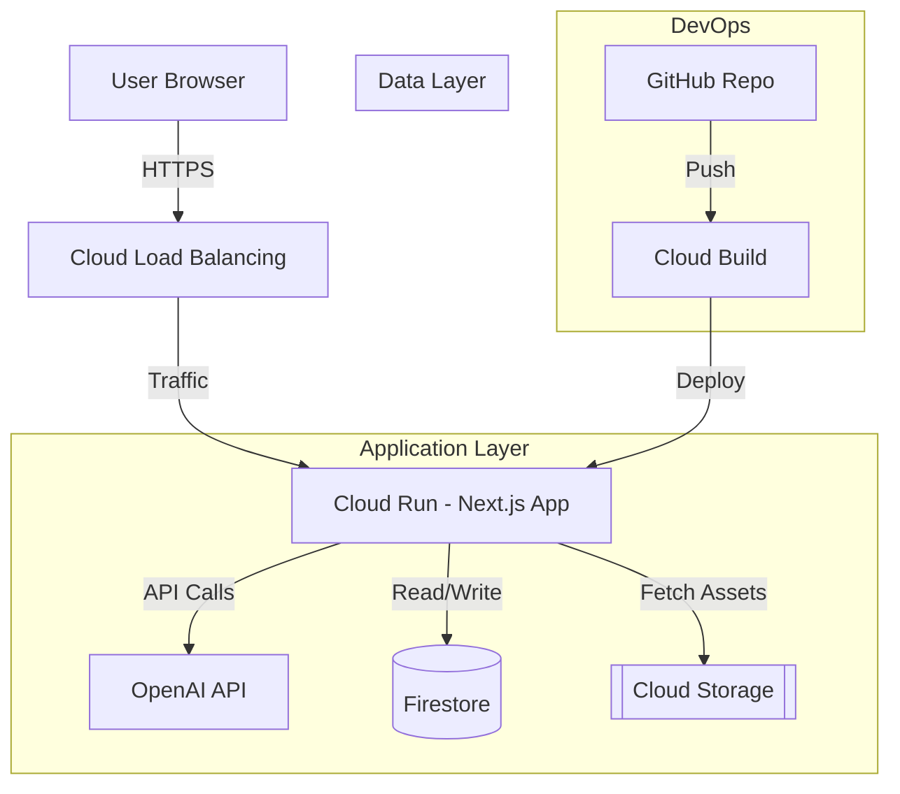

# UniqYou GCP Architecture

## Overview
UniqYou is an AI-powered e-commerce platform hosted on Google Cloud Platform (GCP). The architecture is designed for scalability, performance, and security, leveraging serverless computing for cost-efficiency.

## Architecture Diagram

## Components

### 1. Frontend & Backend (Cloud Run)
- **Service**: Google Cloud Run
- **Description**: Hosts the Next.js application (Server-Side Rendering + API Routes). 
- **Benefits**: 
    - Auto-scaling (scales to zero when not in use).
    - Containerized deployment (Docker).
    - HTTP/2 and gRPC support.

### 2. Database (Firestore)
- **Service**: Google Cloud Firestore (NoSQL)
- **Description**: Stores product catalogs, user sessions, and customization history.
- **Schema**:
    - `products`: { id, name, base_model_url, default_config }
    - `sessions`: { id, user_id, current_customization }

### 3. Asset Storage (Cloud Storage)
- **Service**: Google Cloud Storage (GCS)
- **Description**: Stores static assets like 3D models (.glb/.gltf), textures, and generated images.
- **CDN**: Served via Cloud CDN (integrated with Load Balancer) for low latency.

### 4. Artificial Intelligence
- **Integration**: OpenAI API (GPT-4)
- **Function**: Interprets natural language commands (e.g., "Change the dress to silk red") and converts them into JSON parameters for the 3D renderer.

### 5. Networking & Security
- **Cloud Load Balancing**: Global HTTP(S) load balancer for SSL termination and traffic distribution.
- **Secret Manager**: Securely stores API keys (OpenAI Key) and database credentials.

## Deployment Pipeline
1. Code pushed to GitHub.
2. **Cloud Build** triggers a build pipeline.
3. Builds Docker image and pushes to **Artifact Registry**.
4. Deploys new image to **Cloud Run**.
